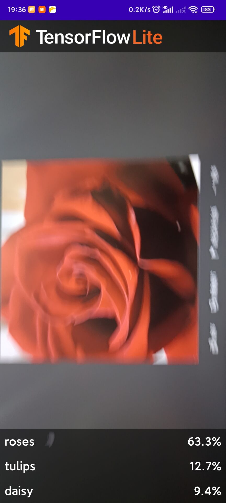

下载代码


补全代码
```java
// TODO 1: Add class variable TensorFlow Lite Model
        // Initializing the flowerModel by lazy so that it runs in the same thread when the process
        // method is called.

        private val flowerModel = FlowerModel.newInstance(ctx) // 使用参数为ctx的构造方法构造FlowerModel对象
// TODO 2: Convert Image to Bitmap then to TensorImage
            val tfImage = TensorImage.fromBitmap(toBitmap(imageProxy))
	// 转换图片为Bitmap再转换为TensorImage
// TODO 3: Process the image using the trained model, sort and pick out the top results
            val outputs = flowerModel.process(tfImage)
                .probabilityAsCategoryList.apply {
                    sortByDescending { it.score }
                }.take(MAX_RESULT_DISPLAY) // 获取相似度ouputs，并按照降序排序，取相似度最高的为结果
// TODO 4: Converting the top probability items into a list of recognitions
            for(output in outputs) {
                items.add(Recognition(output.label, output.score))
            } // 输出相似度最高的三个的标签和相似度
```


效果:
**玫瑰:** 



